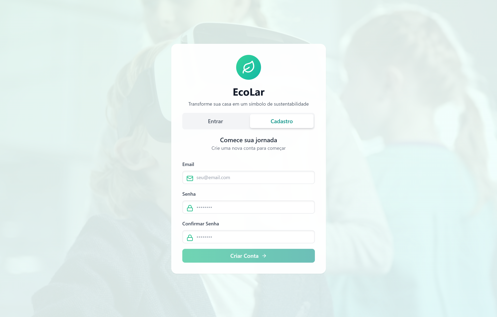

# EcoLar

Aplicação web criada para ajudar famílias a acompanharem e reduzirem seu impacto ambiental, oferecendo um painel completo com consumo de recursos, metas sustentáveis, dicas personalizadas e um quiz educativo.

## Tecnologias

-  **React 18** com Vite 5  
-  **Vite 5**  
-  **Tailwind CSS** para estilização  
-  **React Router DOM** para navegação  
-  **TanStack Query** para gerenciamento de dados  
-  **Framer Motion** e  
   **Lucide Icons** para animações e ícones  
-  **Recharts** para visualização gráfica

## Pré-requisitos

- Node.js 18 ou superior
- npm (instalado automaticamente com o Node.js)

## Configuração do Supabase (passo a passo)

Este projeto usa Supabase para armazenar dados em produção/online. Siga estes passos antes de rodar a aplicação localmente.

### 1) Criar um projeto no Supabase

1. Acesse https://app.supabase.com e faça login (ou crie uma conta).
2. Clique em "New Project".
3. Escolha um nome (por exemplo `eco-lar-demo`) e senha do banco (anote!).
4. Escolha a região mais próxima e crie o projeto.

Observação: a criação pode levar alguns minutos.

#### 1.1 desabilitar confirmação de e‑mail no Supabase:

1. Abra o Supabase Console do seu projeto em https://app.supabase.com e selecione o projeto.
2. No menu lateral, vá em Authentication → Settings (ou Authentication → Configurações).
3. Role até a seção “Email” / “Email confirmations”.
4. Desative a opção “Enable email confirmations” (ou “Confirm email” / “Require email confirmation”) — normalmente é um toggle.
5. Salve as alterações.

### 2) Copiar e rodar o schema (tabelas e seed)

1. No Supabase Console do projeto, abra o menu `SQL` → `SQL editor`.
2. Abra o arquivo `schema.sql` do repositório (na raiz do projeto) e copie seu conteúdo.
3. Cole o conteúdo no editor SQL do Supabase e clique em **RUN**.
4. Verifique na aba `Table Editor` se as tabelas foram criadas com sucesso (por exemplo `tb_user_infos`, `tb_consumption_records`, `tb_tips`, etc.).

Observações importantes:

- Se aparecerem erros, leia a mensagem. Pode ser necessário criar extensões (ex: `pgcrypto`) ou ajustar tipos usados no `schema.sql`.

### 3) Copiar `.env.example` para `.env` e preencher variáveis

1. No repositório local, execute:

```bash
  cp .env.example .env
```

2. Abra `.env` e preencha com os valores do seu projeto Supabase:

- `VITE_SUPABASE_URL` — URL do seu projeto (no Supabase Console → Settings → API → Project URL)
- `VITE_SUPABASE_ANON_KEY` — Anon/public key (Supabase Console → Settings → API → anon key)

Exemplo `.env`:

```
  VITE_SUPABASE_URL=https://xxxx.supabase.co
  VITE_SUPABASE_ANON_KEY=eyJhbGciOiJIUzI1NiIsInR5cCI6IkpXVCJ9...
```

## Como executar

1. Instale as dependências:

```bash
  npm install
```

2. Inicie o servidor de desenvolvimento:

```bash
  npm run dev
```

- O Vite exibirá a URL disponível (por padrão `http://localhost:5173`).

3. Para gerar uma build de produção:

```bash
  npm run build
```

4. Para testar a build localmente:

```bash
  npm run preview
```

## Estrutura principal

```
src/
  api/              # Cliente Supabase para integração backend
  components/       # Componentes reutilizáveis (Button, Input, Sidebar, etc.)
  context/          # Contexto de autenticação (AuthContext)
  data/             # Dados estáticos (perguntas do quiz, dicas, etc.)
  layout/           # Layout principal com Sidebar
  pages/            # Páginas principais (Dashboard, Onboarding, Login, etc.)
  utils/            # Utilidades, rotas e formatações
  main.jsx          # Ponto de entrada do React
  App.jsx           # Definição das rotas da aplicação
  index.css         # Estilos globais com Tailwind
```

## 🔐 Sistema de Autenticação e Proteção de Rotas

### Fluxo de Autenticação

A aplicação usa **Supabase Auth** para gerenciar sessões e **ProtectedRoute** para proteger rotas:

```
┌─────────────────────────────────────────┐
│          Usuário não autenticado        │
│-----------------------------------------│
│         Tenta acessar /dashboard        │
│                    ↓                    │
│          ProtectedRoute verifica        │
│                    ↓                    │
│           Não há sessão válida?         │
│                    ↓                    │
│          Redireciona para /login        │
└─────────────────────────────────────────┘
```

### Rotas Protegidas (Requerem Autenticação)

Essas rotas redirecionam para `/login` se o usuário não estiver autenticado:

- ✅ `/onboarding` - Formulário de personalização (4 passos)
- ✅ `/dashboard` - Painel principal com estatísticas
- ✅ `/add-record` - Registrar consumo de recursos
- ✅ `/goals` - Metas sustentáveis
- ✅ `/tips` - Dicas personalizadas
- ✅ `/calculator` - Calculadora de pegada de carbono
- ✅ `/game` - Quiz educativo com 50 perguntas
- ✅ `/profile` - Perfil e configurações do usuário

### Rotas Públicas (Sem Proteção)

Essas rotas são acessíveis sem autenticação:

- 🌍 `/intro` - Tela de boas-vindas com vídeo motivacional
- 🔑 `/login` - Login e Signup com validação
- `/` - Redireciona para `/intro`

### Componentes Principais

#### `AuthContext.jsx`
Gerencia o estado de autenticação da aplicação:

```jsx
const { currentUser, loading, logout } = useAuth();

// currentUser: objeto do usuário ou null
// loading: boolean indicando carregamento
// logout(): função para deslogar
```

#### `ProtectedRoute.jsx`
Componente que envolve rotas protegidas:

```jsx
<ProtectedRoute>
  <Dashboard />
</ProtectedRoute>

// Comportamentos:
// - Se carregando: mostra spinner
// - Se não autenticado: redireciona para /login
// - Se autenticado: renderiza normalmente
```

## 📍 Rotas Disponíveis

| Rota | Autenticação | Descrição |
|------|--------------|-----------|
| `/` | ❌ | Redireciona para `/intro` |
| `/intro` | ❌ | Vídeo motivacional com slides |
| `/login` | ❌ | Login/Signup com Supabase Auth |
| `/onboarding` | ✅ | Formulário 4 passos (casa, transporte, energia, hábitos) |
| `/dashboard` | ✅ | Painel com stats, gráficos e atividade recente |
| `/add-record` | ✅ | Registrar consumo de água, energia, etc. |
| `/goals` | ✅ | Criar e acompanhar metas sustentáveis |
| `/tips` | ✅ | Dicas personalizadas baseadas no perfil |
| `/calculator` | ✅ | Cálculo de emissão de CO₂ |
| `/game` | ✅ | Quiz com 10 perguntas sorteadas de 50 |
| `/profile` | ✅ | Editar dados do usuário |

## 📊 Banco de Dados (Supabase)

### Tabelas Principais

#### `tb_user_infos`
Armazena informações do usuário e status do onboarding:

```sql
- user_id (UUID, PK) - ID do usuário do Supabase Auth
- name (TEXT) - Nome do usuário
- household_size (INT) - Número de pessoas na casa
- transportation_type (TEXT) - Tipo de transporte principal
- heating_type (TEXT) - Tipo de aquecimento/energia
- residence_size (TEXT) - Tamanho da residência
- has_solar_panels (BOOLEAN) - Tem painéis solares?
- has_garden (BOOLEAN) - Tem jardim/horta?
- recycling_habit (TEXT) - Hábito de reciclagem
- onboarding_completed (BOOLEAN) - Completou onboarding?
- created_at (TIMESTAMP) - Data de criação
- updated_at (TIMESTAMP) - Data de atualização
```

#### `tb_consumption_records`
Registros de consumo de recursos:

```sql
- id (UUID, PK)
- user_id (UUID, FK) - Referencia tb_user_infos
- category (TEXT) - "water", "energy", "waste"
- value (NUMERIC) - Valor consumido
- date (DATE) - Data do consumo
- cost (NUMERIC) - Custo do consumo
- created_at (TIMESTAMP)
```

#### `tb_tips`
Dicas e conselhos sustentáveis:

```sql
- id (UUID, PK)
- title (TEXT) - Título da dica
- description (TEXT) - Descrição completa
- category (TEXT) - Categoria (água, energia, etc.)
- impact (TEXT) - Impacto ambiental
- difficulty (TEXT) - Nível de dificuldade
- icon (TEXT) - Ícone emoji
- created_at (TIMESTAMP)
```

#### `tb_goals`
Metas sustentáveis do usuário:

```sql
- id (UUID, PK)
- user_id (UUID, FK) - Referencia tb_user_infos
- title (TEXT) - Título da meta
- description (TEXT) - Descrição
- target (NUMERIC) - Meta a atingir
- current (NUMERIC) - Progresso atual
- deadline (DATE) - Data limite
- completed (BOOLEAN) - Meta atingida?
- created_at (TIMESTAMP)
```

## 🎮 Quiz Educativo (Game)

O quiz contém **50 perguntas** sobre sustentabilidade. Cada sessão sorteará **10 perguntas** aleatoriamente:

- Perguntas sobre economia de água
- Redução de energia
- Reciclagem e resíduos
- Mobilidade sustentável
- Consumo consciente

Estrutura de uma pergunta:

```javascript
{
  id: 1,
  question: "Quanto de água um banho típico consome?",
  options: ["10L", "25L", "50L", "100L"],
  correct: 1,
  explanation: "Um banho típico de 5 minutos consome cerca de 75-100L de água..."
}
```

## 🛠️ Scripts Disponíveis

```bash
# Desenvolvimento - servidor com hot reload
npm run dev

# Build de produção
npm run build

# Preview da build (serve o dist localmente)
npm run preview
```

## ❓ Troubleshooting

### Problema: "Erro 403 Forbidden" ao fazer login

**Solução**: Verifique se as políticas RLS do Supabase estão configuradas corretamente na tabela `tb_user_infos`.

```sql
-- Exemplo de política para permitir leitura/escrita própria
CREATE POLICY "Users can read own data" 
ON tb_user_infos FOR SELECT 
USING (auth.uid() = user_id);
```

### Problema: Loop infinito de redirecionamentos

**Solução**: Verifique se o `useEffect` do `AuthContext` tem dependência vazia `[]` e não contém `loading`.

### Problema: Spinner de carregamento infinito

**Solução**: Abra o DevTools (F12) e verifique se há erros no console. Pode haver erro na chamada `supabase.auth.getUser()`.

### Problema: Sidebar não aparece

**Solução**: Verifique se está logado. A sidebar só aparece em rotas protegidas com `<Layout />`.

## 🤝 Contribuindo

1. Fork o projeto
2. Crie uma branch para sua feature (`git checkout -b feature/AmazingFeature`)
3. Commit suas mudanças (`git commit -m 'Add some AmazingFeature'`)
4. Push para a branch (`git push origin feature/AmazingFeature`)
5. Abra um Pull Request
## 👨‍💻 Desenvolvedores


- [Júnior Medeiros](https://github.com/Medeiros000)
- [Janssen Batista ](https://github.com/janssenbatista)


Sinta-se à vontade para entrar em contato via GitHub para dúvidas, sugestões ou colaborações!
## 📝 Licença

Este projeto é de código aberto e está disponível sob a MIT License.
